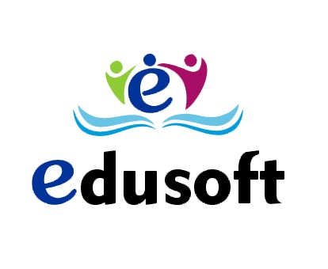

## Edusoft Backend

<p align="center"><a href="#" target="_blank"></a></p>

# Despliegue Edusoft Backend

Se describen los pasos para iniciar la aplicacion en modo desarrollo.

## Installation

Clonar el repositorio en local

```sh
   https://github.com/brieml/edusoft_backend.git
```

## Install PHP dependencies:

```sh
   composer install
```

### Configuración

```sh
   copy .env.example .env
```

### Generar application key

```sh
   php artisan key:generate
```

### Crear symbolic link

```sh
   php artisan storage:link
```

### Ejecutar el servidor de pruebas

```sh
   php artisan serve
```

## License EduSoft

EduSoft - Sistema de notas academicas posee una Licencia de uso no exclusiva de software,
